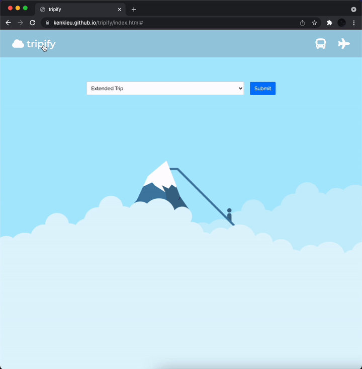

# tripify

A web application for travel enthusiasts who want to track finances for their trip and keep updated with the weather.

## Why Build Tripify?

I built tripify because I had previously used excel sheets to organize financial information for my vacations, but the user interface for excel was clunky. Tripify simplified the experience for me and allowed me to keep up to date with the weather!

## Live Demo

Try the application live at [https://kenkieu.github.io/tripify/index.html](https://kenkieu.github.io/tripify/index.html)

## Technologies Used

- HTML5
- CSS3
- JavaScript ES6
- Weatherbit API

## Features

- User can create a Day Trip with budget, and destination
- User can create an Extended Trip with budget, and destination
- User can add to “Spent” fields and save as they progress through their trip
- User can edit their entries
- User can delete their travel entry

## Preview



## Stretch Features

- Graph budget and spent data
- Button to toggle farenheight to celsius
- Weather only view with search bar

### System Requirements

- IDE that supports HTML, CSS & JavaScript

### Getting Started

1. Clone the repository.

    ```shell
    git clone git@github.com:kenkieu/tripify.git
    cd tripify
    ```

2. Start the project by opening `index.html`.
